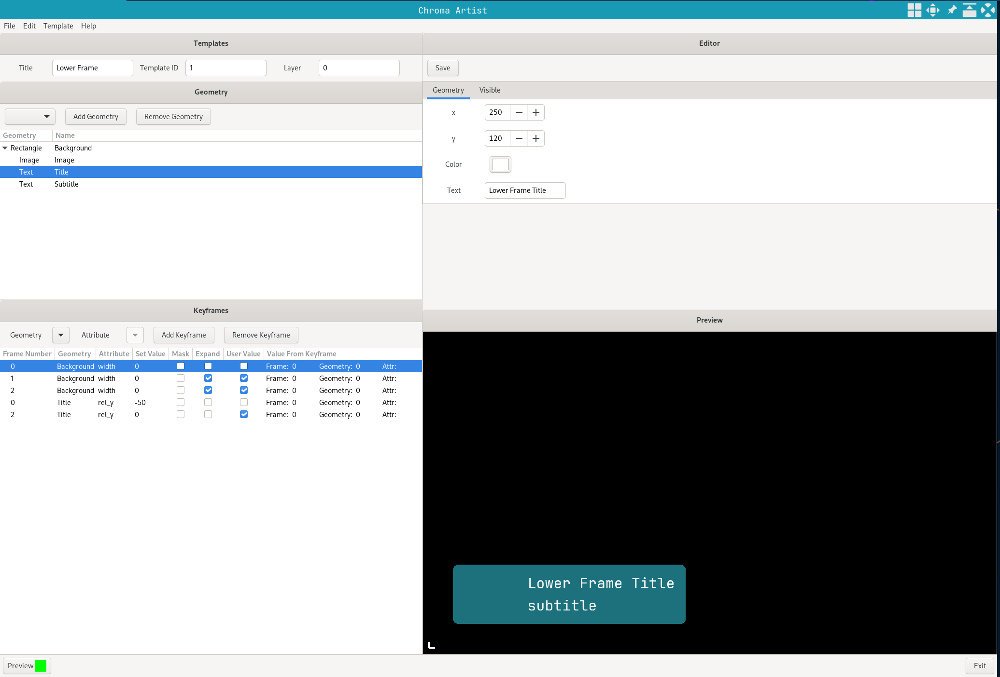

# chroma-viz
Real time broadcast graphics application built in [Golang][go] using [GTK][gotk] go bindings.

## Features

[Chroma Hub][chroma-hub] sends a list of templates to Chroma Viz on startup in order to synchronize templates between Chroma Viz and [Chroma Engine][chroma-engine] instances.
Communicates with [Chroma Engine][chroma-engine] over tcp to render graphics.

- Templates can be added to the show to become pages.
- Each page has its own set of properties, editable through the editor
- [Chroma Engine][chroma-engine] combines the template and the data set in the editor to display the graphic
- Shows and Pages can be exported and imported.

https://github.com/jchilds0/chroma-viz/assets/71675740/8ead1e54-f93e-4d59-8ab7-add3e4d5e648


Chroma Artist can be used to design templates, which can be imported to [Chroma Hub][chroma-hub]

- Tree View for creating the heirachy of geometry elements
- Set which parameters of each geometry can be edited in Chroma Viz
- Add Keyframes to geometries to create animations

https://github.com/jchilds0/chroma-viz/assets/71675740/f082ce39-5cac-478f-8d35-f394881ed7d5



## Installation

- Install and build [Chroma Engine][chroma-engine].
- Set the `PreviewDirectory` in `viz/conf.json` and `artist/conf.json` to the location of the Chroma Engine binary.
- Setup an sql database with the schema in `hub/chroma_hub.sql`
- Build all programs to `bin`
```
make all
```

### Chroma Hub 

- Run Chroma Hub `chroma-hub`
- Import archives/templates or generate random templates using CLI

### Chroma Viz

- Run Chroma Hub
- Run `chroma-viz`

### Chroma Artist 

- Run `chroma-artist`

## Disclaimer

This is a personal project, not an application intended for production.

[go]: https://github.com/golang/go
[gotk]: https://github.com/gotk3/gotk3
[chroma-engine]: https://github.com/jchilds0/chroma-engine
[chroma-hub]: https://github.com/jchilds0/chroma-hub
